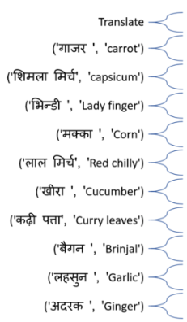

# Hindi to English Translation using Python

This project demonstrates how to translate Hindi text into English using Python and Natural Language Processing. It reads Hindi words from a CSV file, translates them using the Google Translate API, and updates the dataset automatically.

---

## 📌 Project Overview
Language translation is a common NLP task. Using Python and the `googletrans` library, we can easily translate text between multiple languages. This project focuses on translating Hindi vegetable names into English.

---

## 🧠 What This Project Does
- Reads Hindi text from a CSV file
- Translates Hindi to English
- Stores translated words in a dictionary
- Replaces original Hindi text with English
- Outputs the translated dataset

---

## 📦 Libraries Used
- pandas
- googletrans

---

## 🚀 How to Run the Project
- python main.py

## 📄 Sample Output

---

## ⚙️ Installation Steps

1. Clone the repository
2. Navigate to the project folder
cd Hindi-to-English-Translation-Python
3. Install dependencies
pip install -r requirements.txt
